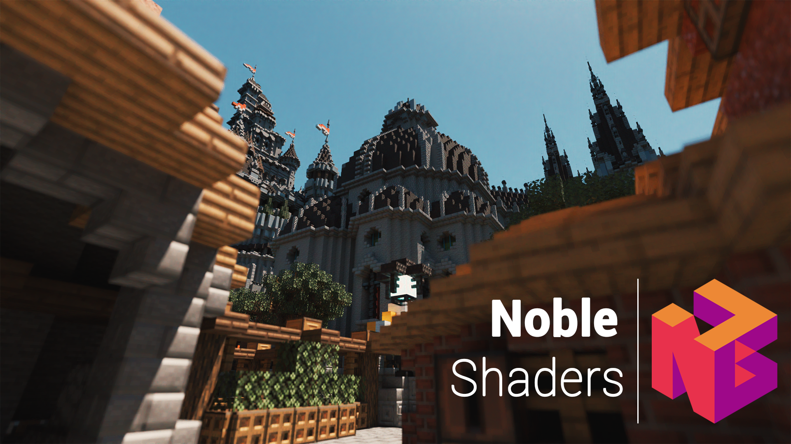
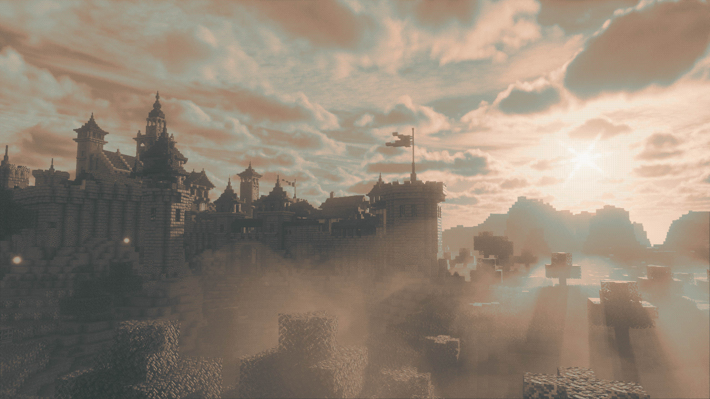

# Noble

Noble finds the perfect balance between performance and realism.  
This Minecraft shader pack uses clever lighting techniques and powerful customization to create immersive, clean, and enjoyable visuals.

### Socials (click the banners)

## Releases

The project is in constant evolution. Therefore, you can expect bug fixes, new features, and
occasional issues along the way.

Noble will always remain **free and open source**. I started this project to learn computer graphics
and have fun, I do not want to monetize it.  
You can still access paid, more engineered versions of Noble on my [Patreon page](https://patreon.com/Belmu).

I've poured hundreds of hours, many sleepless nights, and a lot of coffee into this project. I deeply
hope you enjoy the result!

Feel free to report bugs or discuss ideas on the [Discord server](https://discord.gg/jjRrhpkH9e).

## Supported Mods

  
  &nbsp;&nbsp;&nbsp;&nbsp;&nbsp;&nbsp;&nbsp;&nbsp;
  

## Requirements

> [!IMPORTANT]
> Make sure to unzip the downloaded source code folder.

* **[Optifine](https://optifine.net/home) or [Iris](https://www.irisshaders.dev/) for 1.16 (or newer)**
* A Nvidia graphics card (GTX 950 or newer) **OR**  an AMD graphics card (R7 370 or newer)
* Windows or Linux (MacOS isn't supported)

## Credits

> I would like to thank the people from ShaderLabs for helping me understand and learn GLSL.  
> Thanks to all the testers and bug reporters who regularly help me fix and deal with countless issues.

## Showcases

## License

> [!NOTE]  
> Noble is licensed under the [GNU General Public License V3.0](https://www.gnu.org/licenses/gpl-3.0.en.html).
> Consider reading the terms before modifying or redistributing this project.
